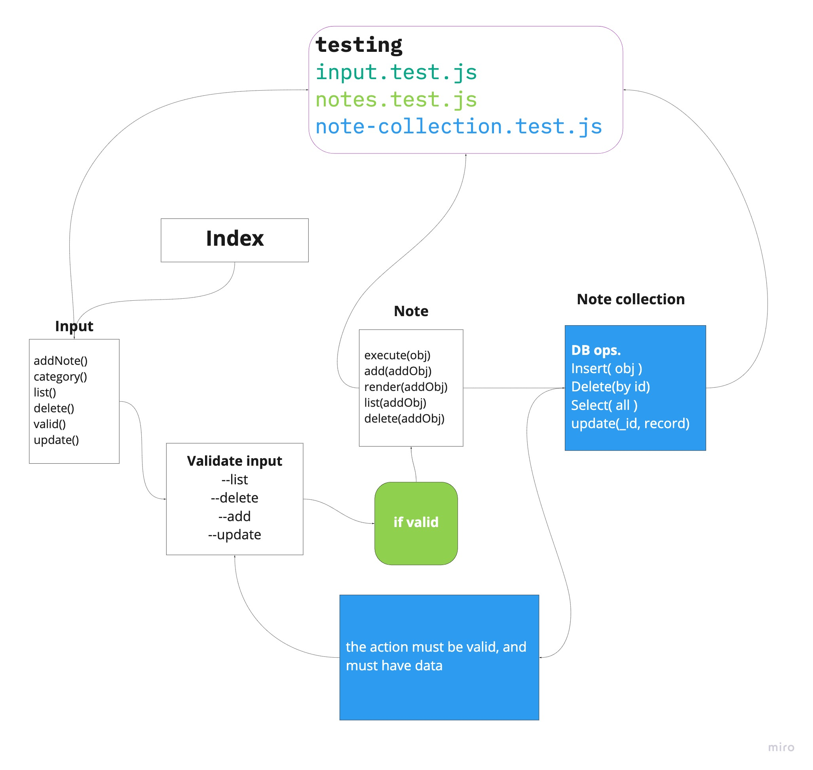

# Notes
 
Author: ***Waleed A. Afifi***

- [submission PR](https://github.com/waleedafifi-401-advanced-javascript/notes/pull/5)

### module 
``note.js``
``input.js``
``Node.js``
``jest``

### Packages
``minimist``
``mongoose``


### Setup
```
npm i minimist
```

**To try this app in your terminal**

- `node index.js --add 'This is a really cool thing that I wanted to remember for later'`
- `node index.js -a 'This is a really cool thing that I wanted to remember for later'`
- `node index.js --a 'valid note' --category health`
- `node index.js --list`
- `node index.js --list catecory`
- `node index.js --delete id`


**This will appear in thee console**

-when run the application with ``node index.js --add 'This is a really cool thing that I wanted to remember for later'``  it will giv an error if the method thad we use not ``(-a || --add)`` and the validation of the note is string, otherwise it will show an error. it tasted with ``if statement``
- test the code with ``jest``

**Testing**
```
npm test
```

#### Pull request
[Class 01](https://github.com/waleedafifi-401-advanced-javascript/notes/pull/1)
[Class 02](https://github.com/waleedafifi-401-advanced-javascript/notes/pull/2)
[Class 03](https://github.com/waleedafifi-401-advanced-javascript/notes/pull/5)

#### UML

